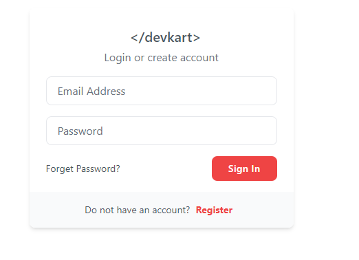
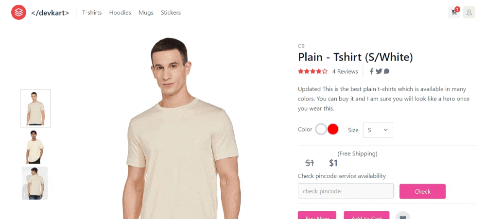
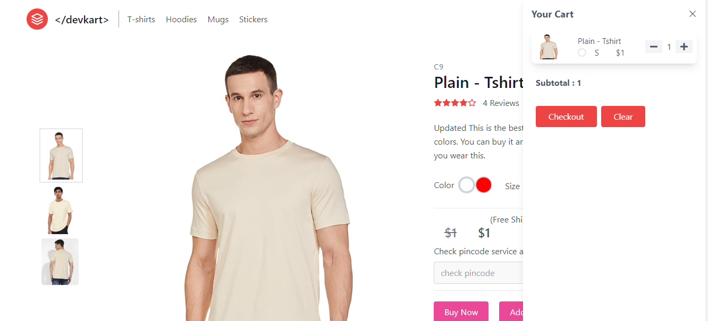
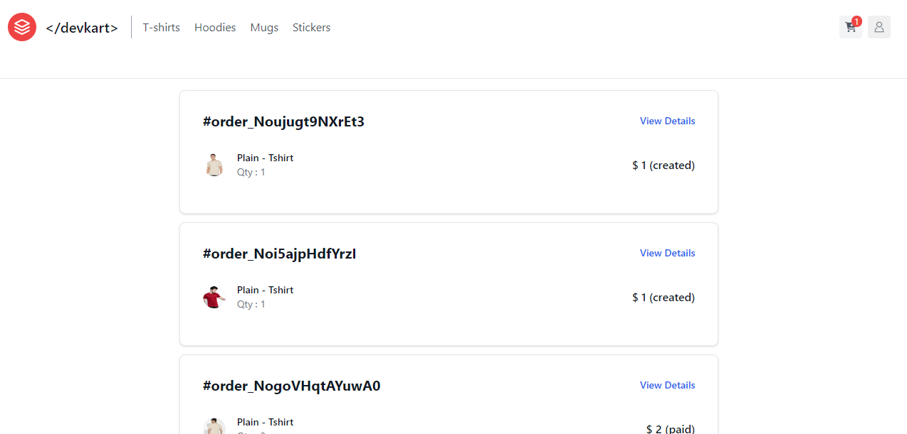
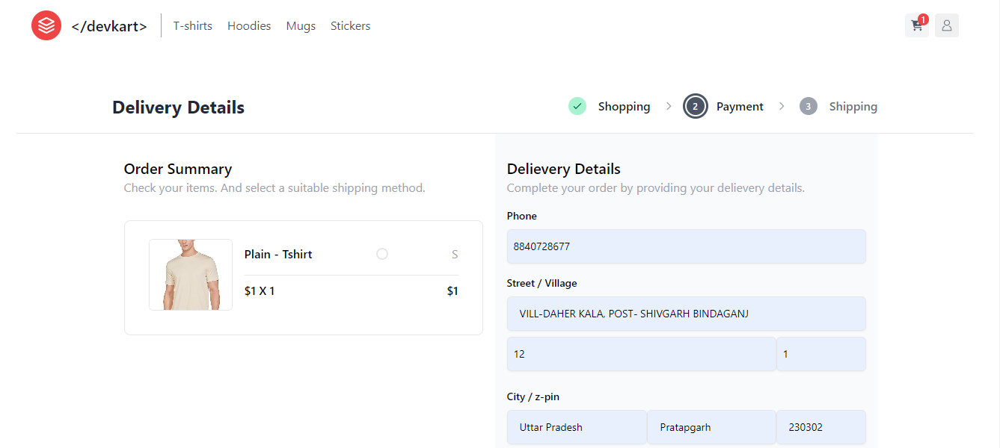
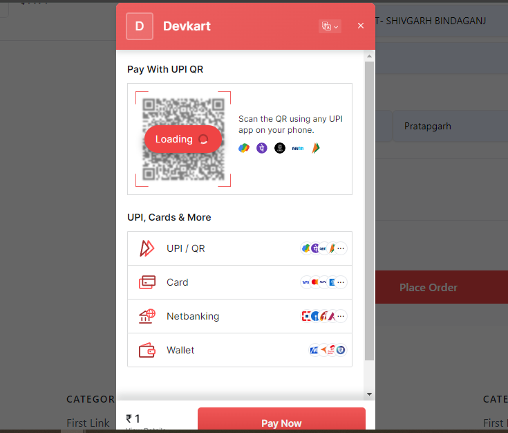
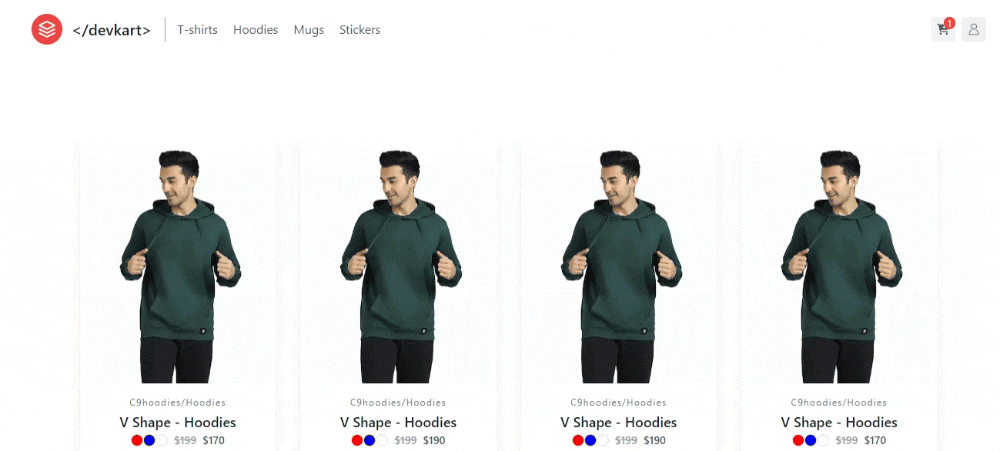

This is a [Next.js](https://nextjs.org/) project bootstrapped with [`create-next-app`](https://github.com/vercel/next.js/tree/canary/packages/create-next-app).


# DevKart E-Commerce Website

DevKart is a fully-fledged e-commerce website built with React, Next.js, Tailwind CSS, Node.js, and MongoDB. It provides a platform for users to browse, purchase, and manage products.

## Getting Started

First, run the development server:

```bash
npm run dev
# or
yarn dev
# or
pnpm dev
# or
bun dev
```

## Features

- **User Authentication**: Allow users to sign up, log in, and manage their accounts securely.


- **Product Catalog**: Display a catalog of products with details such as name, description, price, and images.


- **Shopping Cart**: Enable users to add products to their shopping cart and proceed to checkout.


- **Order Management**: Allow users to view their order history and track the status of their orders.


- **Checkout**: Allow users to checkout and pay.


- **Payment Integration**: Integrate with Razorpay for secure online payments.


- **Admin Panel**: Provide an admin interface for managing products, orders, and user accounts.
- **Responsive Design**: Ensure the website is optimized for various screen sizes and devices.
- **Infinite Scroll**: Infinite scroll for items.
- **React Top Scroll Bar**: Ensure the website is optimized for various screen sizes and devices.


## APIs

### 1. addProducts.js

- **Description**: Add new products to the database.
- **Endpoint**: `/api/addProducts`
- **Method**: POST

### 2. checkToken.js

- **Description**: Validate JWT tokens for user authentication only at once if it expired it removes user cred from localStorage and logout.
- **Endpoint**: `/api/checkToken`
- **Method**: POST

### 3. getOrder.js

- **Description**: Retrieve details of a specific order.
- **Endpoint**: `/api/getOrder`
- **Method**: POST

### 4. getOrders.js

- **Description**: Retrieve a list of orders for a user.
- **Endpoint**: `/api/getOrders`
- **Method**: POST

### 5. getProduct.js

- **Description**: Retrieve details of a specific product.
- **Endpoint**: `/api/getProduct`
- **Method**: GET

### 6. getProducts.js

- **Description**: Retrieve a list of all products.
- **Endpoint**: `/api/getProducts`
- **Method**: GET

### 7. login.js

- **Description**: Handle user authentication and login.
- **Endpoint**: `/api/login`
- **Method**: POST

### 8. pincode.js

- **Description**: Check if a pincode is available for shipping.
- **Endpoint**: `/api/pincode`
- **Method**: POST

### 9. posttransaction.js

- **Description**: Handle order status and update product quantity after successful payment.
- **Endpoint**: `/api/posttransaction`
- **Method**: POST

### 10. pretransaction.js

- **Description**: Create orders and initiate payment transactions.
- **Endpoint**: `/api/pretransaction`
- **Method**: POST

### 11. signup.js

- **Description**: Handle user registration and signup.
- **Endpoint**: `/api/signup`
- **Method**: POST

### 12. updateProducts.js

- **Description**: Update details of existing products in the database.
- **Endpoint**: `/api/updateProducts`
- **Method**: POST

# MongoDB JSON Structure for Product and Orders

```
    "products": [
        {
        "_id": "65fb152abf0d650e18d1f41f",
        "title": "Plain - Tshirt",
        "slug": "plain-t-shirt-new",
        "desc": "Updated This is the best plain t-shirts which is available in many colors. You can buy it and I am sure you will look like a hero once you wear this.",
        "img": "/images/tshirts/tshirt.jpg",
        "category": "tshirt",
        "brand": "c9",
        "price": 1,
        "availableQty": 68,
        "variants": [
            {
            "color": "white",
            "sizes": {
                "M": 11,
                "S": 2,
                "XXL": 15
            },
            "images": [
                "/images/tshirts/tshirt.jpg",
                "/images/tshirts/tshirt2.jpg",
                "/images/tshirts/tshirt3.jpg"
            ],
            "_id": "65ef0c1e319ea1f5900c7e2c"
            },
            {
            "color": "red",
            "sizes": {
                "M": 12,
                "S": 1,
                "L": 12,
                "XXL": 15
            },
            "images": [
                "/images/tshirts/tshirt4.jpg",
                "/images/tshirts/tshirt5.jpg",
                "/images/tshirts/tshirt6.jpg"
            ],
            "_id": "65ef0c1e319ea1f5900c7e2c"
            }
        ],
        "discount": 0,
        "createdAt": "2024-03-20T16:56:10.736Z",
        "updatedAt": "2024-03-20T17:20:17.179Z",
        "__v": 0
        }
    ]
```

```
{
  "_id": {
    "$oid": "65f9638358afe5840443f28f"
  },
  "email": "kamchalau1919@gmail.com",
  "orderId": "order_NoAtKtw4ngjhYn",
  "paymentInfo": {
    "razorpay_order_id": "order_NoAtKtw4ngjhYn",
    "razorpay_payment_id": "pay_NoAtxtzQZvEqHG",
    "razorpay_signature": "48b561a88a1e33459c513927bbe1abd8a31515f578d57ab4dbbf3ea8ce51e2f3",
    "status": "signature verified",
    "_id": {
      "$oid": "65f96fe2439292270643c397"
    }
  },
  "products": [
    {
      "productId": "plain-t-shirt-new",
      "qty": 1,
      "price": 1,
      "name": "Plain - Tshirt",
      "variant": "blue",
      "img": "/images/tshirts/tshirt.jpg",
      "_id": {
        "$oid": "65f9638358afe5840443f291"
      }
    }
  ],
  "address": {
    "phone": "8840728677",
    "street": "VILL-DAHER KALA, POST- SHIVGARH BINDAGANJ",
    "landmark": "",
    "roomno": "1",
    "state": "Uttar Pradesh",
    "city": "Pratapgarh",
    "zip": "230302",
    "_id": {
      "$oid": "65f9638358afe5840443f292"
    }
  },
  "amount": 100,
  "status": "paid",
  "createdAt": {
    "$date": "2024-03-19T10:05:55.121Z"
  },
  "updatedAt": {
    "$date": "2024-03-19T10:58:42.699Z"
  },
  "__v": 0
}
```

## Technologies Used

- **React**: A JavaScript library for building user interfaces.
- **Next.js**: A React framework for building server-side rendered and statically generated web applications.
- **Tailwind CSS**: A utility-first CSS framework for quickly building custom designs.
- **Node.js**: A JavaScript runtime environment that allows you to run JavaScript code on the server-side, handle HTTP requests, and implement server-side logic.
- **MongoDB**: A NoSQL database used for storing and managing data.
- **bcryptjs**: A library for hashing passwords securely.
- **jsonwebtoken**: A library for generating and verifying JSON Web Tokens (JWT).
- **Razorpay**: A payment gateway integration library for handling online payments.

## Getting Started

1. Clone the repository:

   ```bash
   git clone https://github.com/yourusername/devkart.git


Open [http://localhost:3000](http://localhost:3000) with your browser to see the result.

You can start editing the page by modifying `pages/index.js`. The page auto-updates as you edit the file.

[API routes](https://nextjs.org/docs/api-routes/introduction) can be accessed on [http://localhost:3000/api/hello](http://localhost:3000/api/hello). This endpoint can be edited in `pages/api/hello.js`.

The `pages/api` directory is mapped to `/api/*`. Files in this directory are treated as [API routes](https://nextjs.org/docs/api-routes/introduction) instead of React pages.

This project uses [`next/font`](https://nextjs.org/docs/basic-features/font-optimization) to automatically optimize and load Inter, a custom Google Font.

## Learn More

To learn more about Next.js, take a look at the following resources:

- [Next.js Documentation](https://nextjs.org/docs) - learn about Next.js features and API.
- [Learn Next.js](https://nextjs.org/learn) - an interactive Next.js tutorial.

You can check out [the Next.js GitHub repository](https://github.com/vercel/next.js/) - your feedback and contributions are welcome!

## Deploy on Vercel

The easiest way to deploy your Next.js app is to use the [Vercel Platform](https://vercel.com/new?utm_medium=default-template&filter=next.js&utm_source=create-next-app&utm_campaign=create-next-app-readme) from the creators of Next.js.

Check out our [Next.js deployment documentation](https://nextjs.org/docs/deployment) for more details.
